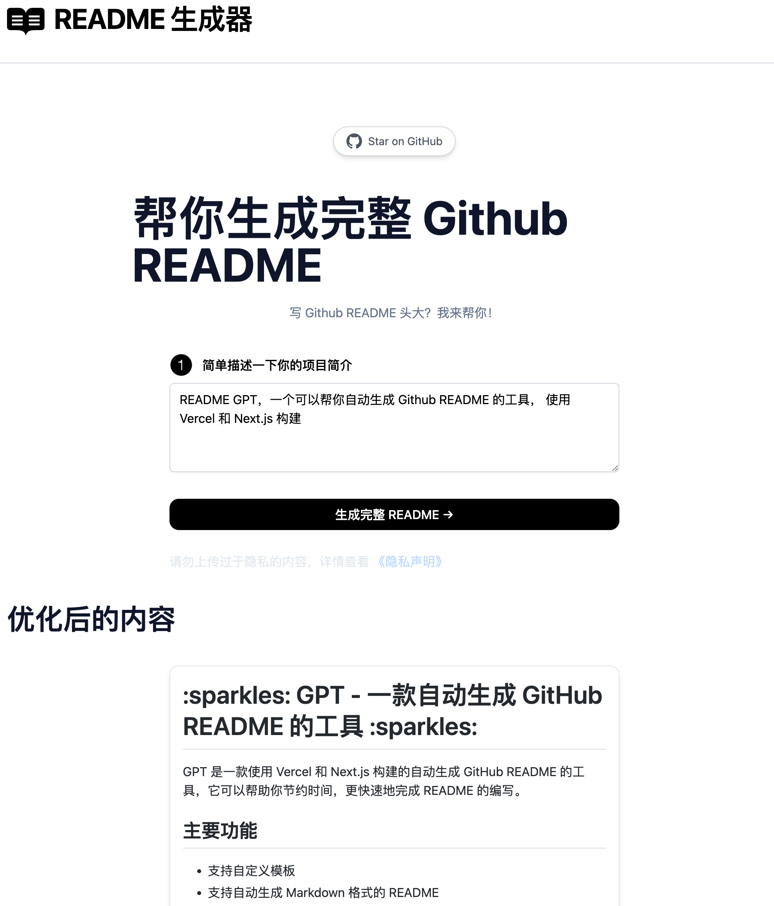

# [README Generator](https://readme.rustc.cloud/)

[中文版（By GPT）](./README-zh_CN.md)

This project simplify chat content for you using AI.

[](https://readme.rustc.cloud/zh)

## 它是如何工作的

该项目使用OpenAI GPT-3 API（具体来说是gpt-3.5-turbo）和Vercel Edge函数进行流式处理。它根据表单和用户输入构建提示，通过Vercel Edge函数将其发送到GPT-3 API，然后将响应流回应用程序。

## 一键部署

使用部署示例 [Vercel](https://vercel.com?utm_source=github&utm_medium=readme&utm_campaign=vercel-examples):

[](https://vercel.com/new/clone?repository-url=https://vercel.com/new/clone?repository-url=https://github.com/constself/ChatGPT-Readme&env=OPENAI_API_KEY,NEXT_PUBLIC_USE_USER_KEY,OPENAI_MODEL&project-name=readme_gpt&repo-name=readme_gpt)

NEXT_PUBLIC_USE_USER_KEY = false
OPENAI_MODEL = gpt-3.5-turbo

<!-- https://www.seotraininglondon.org/gpt3-business-email-generator/ -->

## 本地运行

**1. 克隆Repo**

```bash
git clone https://github.com/constself/ChatGPT-Readme
```

**2. 安装依赖**

```bash
npm install
```

**3. 提供OpenAI API密钥**

在仓库的根目录下创建一个`.env`文件，进入 `.env.example` 文件，复制内容到 `.env` 文件，其中包含您的[OpenAI API](https://platform.openai.com/account/api-keys) 密钥：

```bash
OPENAI_API_KEY=YOUR_KEY
```

**4. 运行应用程序 本地项目运行在 `http://localhost:3000/`**

```bash
npm run dev
```

**5. 使用它**

您应该能够开始聊天。

## 环境变量

配置本地或者部署的环境变量

| 名称                  | 描述                               | 默认                     |
| :-------------------- | ---------------------------------- | ------------------------ |
| `OPENAI_API_KEY`      | 你的 OpenAI API Key                | `null`                   |
| `OPENAI_API_BASE_URL` | 请求 OpenAI API 的自定义 Base URL. | `https://api.openai.com` |
| `OPENAI_MODEL`        | `API`模型                          | `gpt-3.5-turbo`          |
